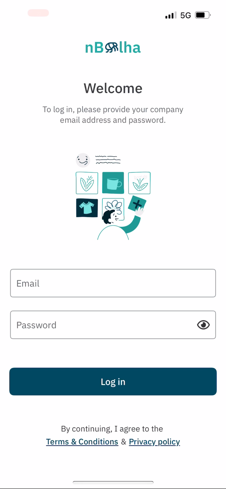
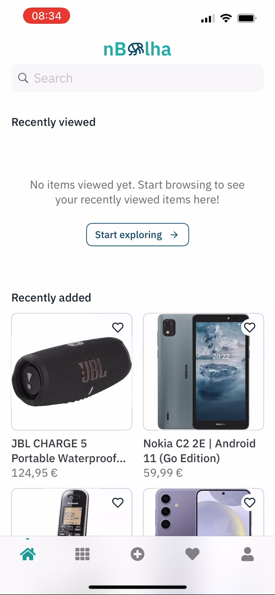
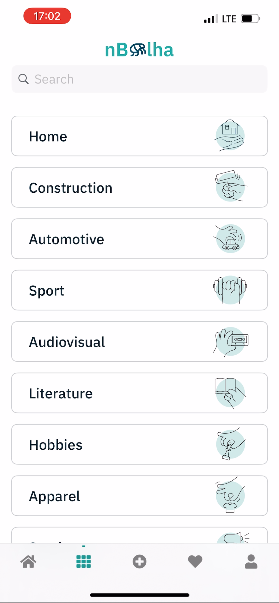
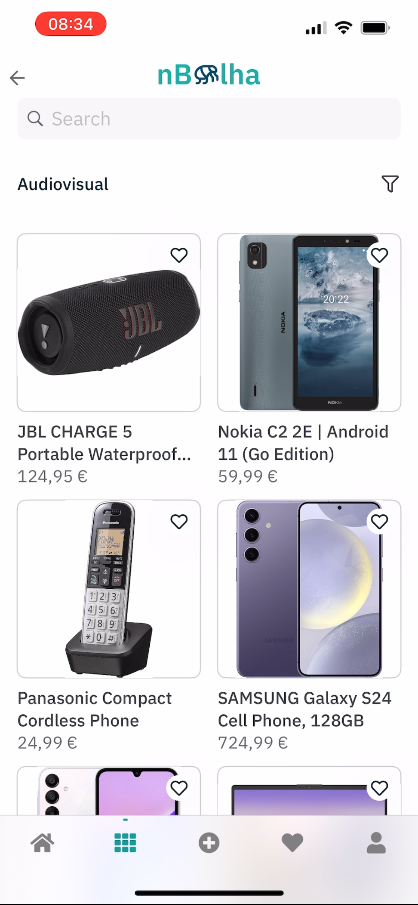
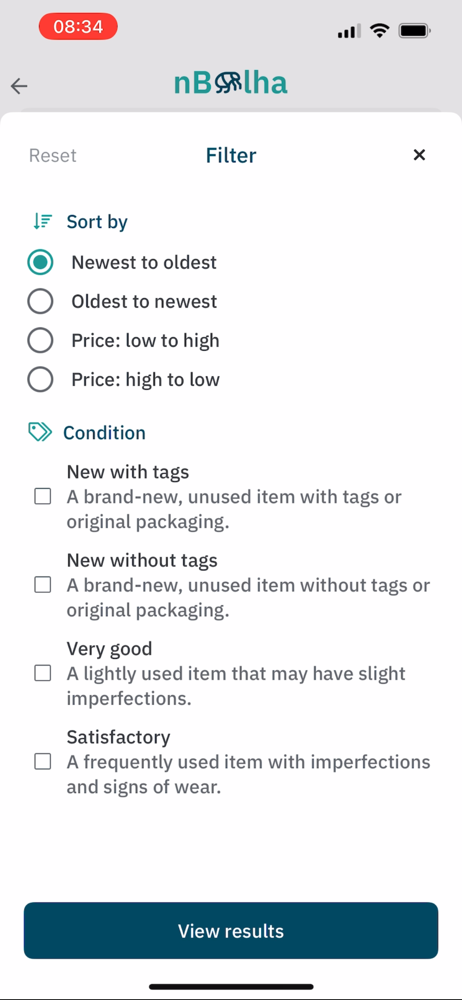
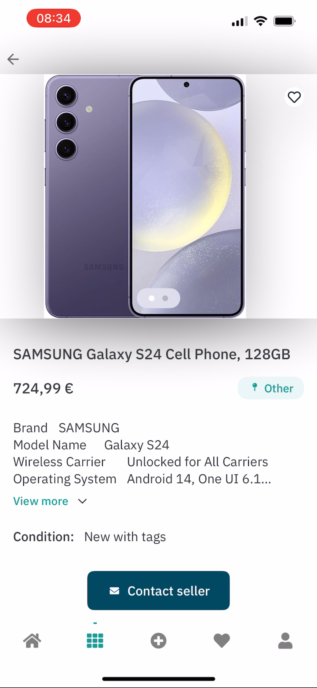
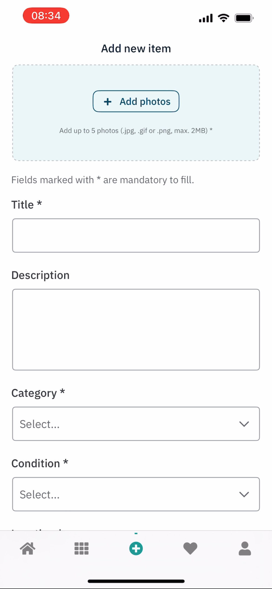
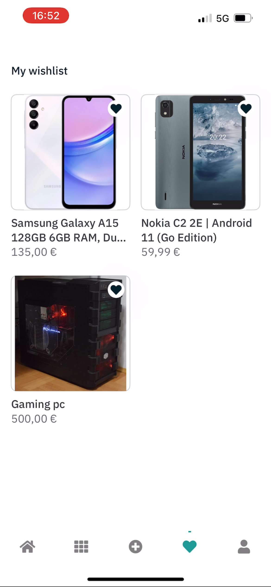
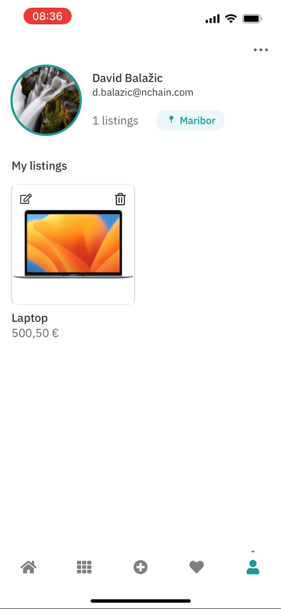

# 📱 nBolha (iOS)

**nBolha** is a modern, internal marketplace app developed in **Swift** for iOS devices, designed for employees within a company. With nBolha, staff can easily buy, sell, and manage second-hand items within the company — securely and efficiently.

> 🚧 _This app is for internal use only and not available to the public._

---

## 📌 App Description

nBolha enables employees to connect and exchange products within their organization through a user-friendly interface. The app offers:

- 👤 **User Login**  
  Secure authentication for company employees using internal credentials.

- 🏠 **Home Feed: Recently Viewed & Recently Added**  
  View the latest products and your recently browsed items — all in one place.

- 🧰 **Category Browsing**  
  Explore products across various sections like:
  - 🛠️ Construction
  - 💻 Electronics
  - 🪑 Furniture
  - 🎮 Entertainment
  - ...and more

- 🔍 **Filtering & Search**  
  Easily filter products by category, price, or recency to find what you need quickly.

- ➕ **Add New Listings**  
  Create product listings with images, descriptions, and price directly from the app.

- 💖 **Wishlist**  
  Save products you’re interested in for future consideration.

- 👤 **User Profile**  
  Manage your listings, view saved items, and update your profile information.

---

## 🧠 Key Features

- ✅ Secure user login & registration
- 📰 Recent activity feed (viewed & added items)
- 🧭 Multi-category navigation
- 🔎 Powerful filtering options
- 📸 Add product listings with images
- 💾 Wishlist functionality
- 👤 Profile management

---

## 🛠️ Tech Stack

- **Language:** Swift
- **UI Framework:** Hybrid approach
  - **UIKit** – For app navigation and lifecycle
  - **SwiftUI** – For views and component rendering
- **Architecture:** MVVM (Model-View-ViewModel)
- **Authentication:** Token-based

---

## 🖼️ Screenshots

| Login | Home | Categories |
|:------:|:----:|:----------:|
|  |  |  |

| Categories Selected | Filter | Product Detail |
|:-------------------:|:------:|:--------------:|
|  |  |  |

| Add Product | Wishlist | Profile |
|:-----------:|:--------:|:-------:|
|  |  |  |


---

## 🚀 Getting Started

### Prerequisites

- macOS with Xcode 14+
- iOS simulator or device

### Installation

1. Clone the repository:
   ```bash
   git clone https://github.com/your-username/nBolha.git
   cd nBolha
